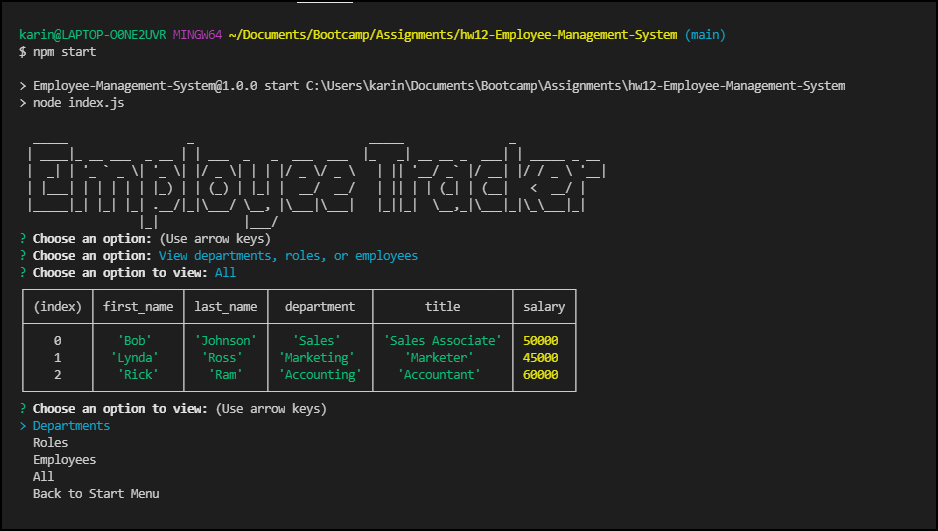

# Employee Management System

 &nbsp;&nbsp;&nbsp;&nbsp; &nbsp;&nbsp;&nbsp;&nbsp; &nbsp;&nbsp;&nbsp;&nbsp;

## :memo: Description
  This is a Node.js command-line application that receives information about employees, roles, and departments within a company to keep track of their information and association to one another. The application uses MySQL to build three tables of data that interconnect. This data will display in the terminal as well as inside of MySQL Workbench.


## :trophy: Table of Contents
* [Installation](#installation)
* [Usage](#usage)
* [Contributing](#contributing)
  
  
## Installation
To run locally:
* Fork the https://github.com/Karina5151/Employee-Management-System repo.
* Clone your forked repo to VS Code on your computer.
* Open entire parent folder of the project in your terminal.
* Install the node dependencies by entering in the terminal:
```
npm i
```
* Then create a .env file with the following:

> DB_NAME=employee_trackerDB
>
> DB_PASSWORD=your_MySQLWorkbench_password_here 
>
> DB_USER=root

* Copy the text from the `employee_tracker.sql` file and paste into Workbench, hit the lightning to create the database.
  
## Usage
To create and store employee, role, and department data in MySQL by completing all prompts in the terminal upon running:
```
npm start
```
<a href="https://drive.google.com/file/d/19VqutEpHht2gTpuPucoulczYzS371QG7/view?usp=sharing" rel="nofollow" target="_blank">Click here for the full screen demo</a>



  
## Contributing
This application was developed by Karina Clausen.

The technologies that made this possible are:
* <a href="https://www.javascript.com/" target="_blank">JavaScript</a>
* <a href="https://nodejs.org/api/fs.html" target="_blank">Node.js</a>
* <a href="https://www.npmjs.com/package/inquirer" rel="nofollow" target="_blank">Inquirer</a>
* <a href="https://www.npmjs.com/package/console.table" target="_blank">console.table</a>
* <a href="https://www.npmjs.com/package/dotenv" target="_blank">dotenv</a>
* <a href="https://www.npmjs.com/package/figlet" target="_blank">figlet</a>
* <a href="https://www.mysql.com/" target="_blank">MySQL</a>
* <a href="https://www.mysql.com/products/workbench/" target="_blank">MySQL Workbench</a>


 ---

## :question: Questions

For any questions, please contact me using the information below:

:octocat: GitHub: [@Karina5151](https://github.com/Karina5151)

:envelope: Email: karina.clausen.11@gmail.com
